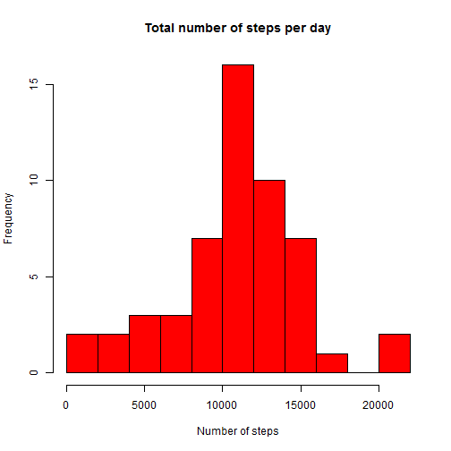
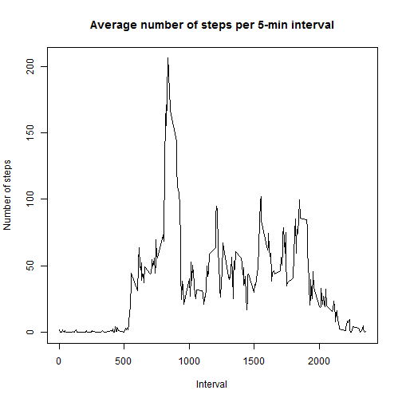
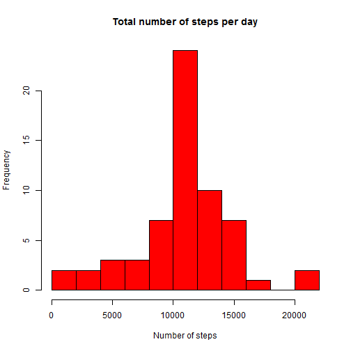
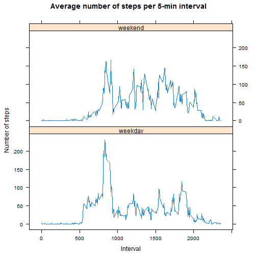

## Loading and preprocessing the data

##### 1. Load the data (i.e. read.csv())


```r
library(data.table)
if(!file.exists("activity.csv")) unzip("activity.zip")
activity <- fread("activity.csv")
```

##### 2. Process/transform the data (if necessary) into a format suitable for your analysis


```r
library(lubridate)
activity[,date := ymd(date)]    # Transform date into class Date        
```
  
## What is mean total number of steps taken per day?

##### 1. Make a histogram of the total number of steps taken each day


```r
steps.per.day <- activity[!is.na(steps), .(total=sum(steps)), by=date]
hist(steps.per.day$total,
     main = "Total number of steps per day",
     xlab = "Number of steps",
     ylab = "Frequency",
     col = "red",
     breaks = 10)
```

 

##### 2. Calculate and report the mean and median total number of steps taken per day


```r
steps.per.day[, .(mean=mean(total), median=median(total))]
```

```
##        mean median
## 1: 10766.19  10765
```

The mean = 10766.19 and median = 10765.

## What is the average daily activity pattern?

##### 1. Make a time series plot (i.e. type = "l") of the 5-minute interval (x-axis) and the average number of steps taken, averaged across all days (y-axis)


```r
steps.per.interval <- activity[!is.na(steps), .(mean=mean(steps)), by=interval]
plot(mean ~ interval, steps.per.interval,
        main = "Average number of steps per 5-min interval",
        xlab = "Interval",
        ylab = "Number of steps",
        type = "l")
```

 

##### 2. Which 5-minute interval, on average across all the days in the dataset, contains the maximum number of steps?

```r
steps.per.interval[mean == max(steps.per.interval$mean)]
```

```
##    interval     mean
## 1:      835 206.1698
```

This is the 835-th interval.

## Imputing missing values

Note that there are a number of days/intervals where there are missing values (coded as NA). The presence of missing days may introduce bias into some calculations or summaries of the data.

##### 1. Calculate and report the total number of missing values in the dataset (i.e. the total number of rows with NAs)


```r
sum(is.na(activity))
```

```
## [1] 2304
```

There are 2304 missing values in total.

##### 2. Devise a strategy for filling in all of the missing values in the dataset. The strategy does not need to be sophisticated. For example, you could use the mean/median for that day, or the mean for that 5-minute interval, etc.

Recall the mean for that 5-minute interval, averaged across all days used previously. 
These means are used as estimates for the missing values.


```r
steps.per.interval <- activity[!is.na(steps), .(mean=mean(steps)), by=interval]
```

##### 3. Create a new dataset that is equal to the original dataset but with the missing data filled in.


```r
activity.imputed <- copy(activity)
# Use steps.per.interval to fill missing values
# Note: the means are cast into integers to match the column class of steps
activity.imputed[is.na(steps), steps := steps.per.interval[interval==interval, as.integer(round(mean))]]
```

##### 4. Make a histogram of the total number of steps taken each day and Calculate and report the mean and median total number of steps taken per day. Do these values differ from the estimates from the first part of the assignment? What is the impact of imputing missing data on the estimates of the total daily number of steps?


```r
steps.per.day <- activity.imputed[, .(total=sum(steps)), by=date]
hist(steps.per.day$total,
     main = "Total number of steps per day",
     xlab = "Number of steps",
     ylab = "Frequency",
     col = "red",
     breaks = 10)
```

 

Calculate and report the mean and median total number of steps taken per day


```r
steps.per.day[, .(mean=mean(total), median=median(total))]
```

```
##        mean median
## 1: 10765.64  10762
```
The mean = 10765.64 and median = 10762.

It can be seen that these values differ from the estimates from the first part of the assignment.
The mean and median of the total daily number of steps are slightly lower for the dataset with imputed missing values.

## Are there differences in activity patterns between weekdays and weekends?

For this part the weekdays() function may be of some help here. Use the dataset with the filled-in missing values for this part.

##### 1. Create a new factor variable in the dataset with two levels - "weekday" and "weekend" indicating whether a given date is a weekday or weekend day.


```r
# Note: lubridate::wday() is used rather than weekdays() because weekdays() returns localized days.
daytype <- ifelse(wday(activity.imputed$date, label = TRUE) %in% c("Sat","Sun"), "weekend", "weekday")
activity.imputed[, daytype := factor(daytype)]
```

##### 2. Make a panel plot containing a time series plot (i.e. type = "l") of the 5-minute interval (x-axis) and the average number of steps taken, averaged across all weekday days or weekend days (y-axis). See the README file in the GitHub repository to see an example of what this plot should look like using simulated data.


```r
library(lattice)
steps.per.interval <- activity.imputed[, .(mean=mean(steps)), by=.(interval,daytype)]

xyplot(mean ~ interval | daytype, data = steps.per.interval,
       main = "Average number of steps per 5-min interval",
       xlab = "Interval",
       ylab = "Number of steps",
       type = "l",
       layout=c(1, 2))
```

 

The average activity seems to be higher in the weekend, this can also be concluded when comparing the mean and median for both daytypes:


```r
steps.per.interval[, .(mean=mean(mean), median=median(mean)), by=daytype]
```

```
##    daytype     mean   median
## 1: weekday 35.60864 25.81111
## 2: weekend 42.36458 32.31250
```
